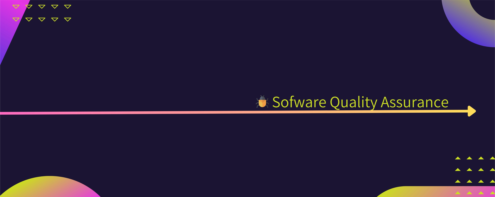

<h1 align="center">
 Hello!

</h1>



<h2>:man_technologist: About Me :</h2>

```js

const marck = {
  name: 'Marcos Silva',
  pronouns: 'he' | 'him',
  title: 'QA tester',
  passions: 'Quality Assurance'
}
```
<h2> Connect with me on 👇</h2>
<a href="www.linkedin.com/in/marcos-silva-98270a1b9" target="_blank">

</a>

<h2> Github Stats: </h2> 


<h2>:hammer_and_wrench: Technologies and Tools I use:</h2>
<h3>👨‍💻 Programming Languages : </h3>
<div>
<code></code>
<code></code>
<code></code>   
<code></code>
</div>

<h3>🌐 Web Testing : </h3>
<div>
<code></code>
<code></code>
<code></code>
</div>
  
<h3>🕸️ Api Testing :</h3> 
<div>
<code></code>
<code></code>
<code></code>
<code></code>
</div>

<h3>📈 Performance Testing :</h3>
<div>
<code></code>
<code></code>
</div>
  
<h3>📱 Mobile Testing :</h3>
<div>
<code></code>
<code></code>
</div>

<h3>📱 Data Base :</h3>
<div>
<code></code>
<code></code>
 <code></code>
</div>
